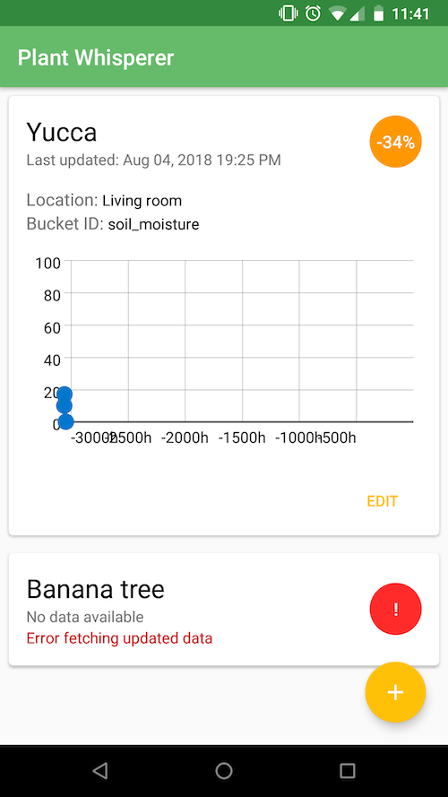

# PlantWhisperer

This is an Android app that displays the soil moisture level of your house / garden plants.
The app connects to a thinger.io server through a RESTful API and, for each registered plant, retrieves numeric data from a specific bucket.

## License

This project is licensed under the GNU GPL v3 - see the [LICENSE.md](LICENSE.md) file for details

