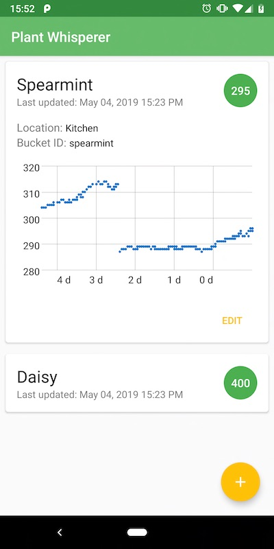

# PlantWhisperer

This is an Android app that displays the soil moisture level of your house / garden plants.
The app connects to a thinger.io server through a RESTful API and, for each registered plant, retrieves numeric data from a specific bucket.

## Repository structure

- `root` root of the android app directory, can be cloned into Android Studio
  - `Arduino` contains the arduino code for the device part of the project
  
## Android app

## Arduino-based device

The device consists of an ESP8266 and a humidity sensor. The ESP8266 wakes up, polls the humidity sensor at regular intervals and uploads the data to a thinger.io bucket.

## License

This project is licensed under the GNU GPL v3 - see the [LICENSE.md](LICENSE.md) file for details

